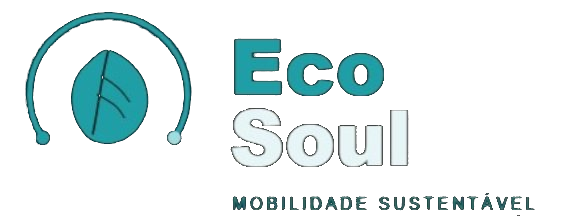
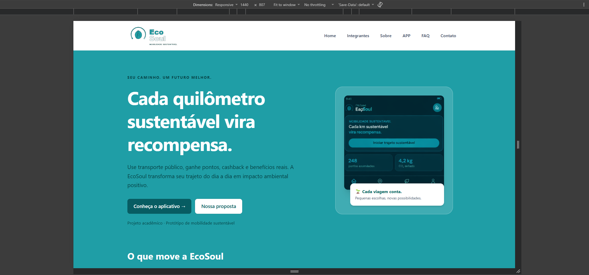
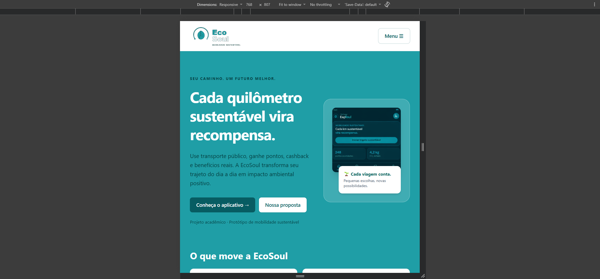
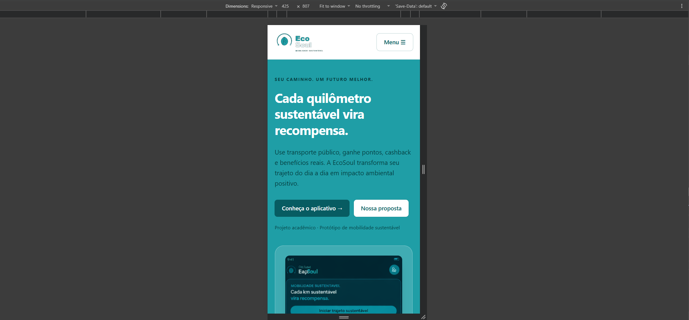

# EcoSoul — Challenge SoulUp | Sprint 3

<p align="center">
  
</p>

## Descrição do projeto

A EcoSoul é uma ideia de app para incentivar as pessoas a usar ônibus, metrô e trem. A proposta é que cada viagem gere ECO Points, que poderão ser trocados por benefícios. O app também mostraria o quanto essas viagens ajudam a reduzir a emissão de CO₂.

Fizemos este projeto para a matéria de **Front-End Design Engineering**, no Challenge SoulUp da FIAP. Nesta Sprint 3, passamos o site da sprint passada para **React + Vite + TypeScript**. Também usamos Tailwind para os estilos e React Hook Form para validar o formulário.

## O que funciona por enquanto

No site, dá para conhecer a ideia da EcoSoul, ver os integrantes, tirar dúvidas no FAQ e acessar a página de contato. O menu, as perguntas do FAQ e a validação do formulário já funcionam.

As telas do app são exemplos da nossa proposta. GPS, IA, contas, cálculo de CO₂ e troca de pontos ainda não funcionam de verdade. O formulário só confere os campos, sem enviar ou salvar mensagens. Nesta sprint, não usamos API.

## Tecnologias utilizadas

| Tecnologia | Para que usamos |
| --- | --- |
| React | Montar as páginas e reaproveitar componentes |
| Vite | Rodar o site e gerar a versão final |
| TypeScript | Definir os tipos dos dados e das props |
| Tailwind CSS | Estilizar o site e ajustar para diferentes telas |
| React Router DOM | Trocar de página sem recarregar o site e criar rotas |
| React Hook Form | Controlar o formulário e conferir os campos |
| Oxlint | Verificar possíveis problemas no código |
| Git e GitHub | Salvar o histórico e organizar o trabalho do grupo |

## Estrutura de pastas

```text
Challenge_SoulUp/
├── .git/                       # Histórico Git
├── README.md                   # Documentação
├── img/                        # Prints do site
│   ├── computador.png
│   ├── tablet.png
│   └── celular.png
└── EcoSoul/                    # Aplicação React
    ├── public/
    │   └── img/                # Logo, fotos e protótipos
    ├── src/
    │   ├── components/
    │   │   ├── Botao/
    │   │   ├── Cabecalho/
    │   │   ├── CampoFormulario/
    │   │   ├── Card/
    │   │   ├── CardFuncionalidade/
    │   │   ├── Menu/
    │   │   ├── PerguntaFaq/
    │   │   ├── Rodape/
    │   │   └── TituloPagina/
    │   ├── css/
    │   │   └── main.css        # Importação e configuração do Tailwind
    │   ├── dados/
    │   │   ├── faq.ts
    │   │   ├── project.ts
    │   │   └── tipos.ts
    │   ├── pages/
    │   │   ├── Contato/
    │   │   ├── Faq/
    │   │   ├── Funcionalidade/
    │   │   ├── Home/
    │   │   ├── Integrantes/
    │   │   ├── NaoEncontrada/
    │   │   ├── Sobre/
    │   │   └── Solucao/
    │   ├── App.tsx             # Layout compartilhado
    │   └── main.tsx            # Entrada e configuração das rotas
    ├── .gitignore
    ├── .oxlintrc.json
    ├── index.html
    ├── package.json
    ├── package-lock.json
    ├── tsconfig.json
    ├── tsconfig.app.json
    ├── tsconfig.node.json
    └── vite.config.ts
```

## Como rodar o projeto

### O que precisa ter instalado

Você precisa do Node.js e do npm para rodar o site. O Vite usado neste projeto aceita Node.js 20 a partir da versão 20.19, ou versões a partir da 22.12. Na conferência local, estavam instalados Node.js 24.19.0 e npm 11.17.0. Para baixar pelo comando abaixo, também precisa do Git.

### Pelo GitHub

Baixe a branch `main`, entre na pasta do projeto e rode os comandos:

```bash
git clone --branch main https://github.com/Giovanni0403/Challenge_SoulUp.git
cd Challenge_SoulUp/EcoSoul
npm i
npm run dev
```

Abra no navegador o endereço que aparecer no terminal, normalmente `http://localhost:5173`. O site precisa ser iniciado pelo Vite; abrir o `index.html` direto não é suficiente. Para parar o servidor, pressione `Ctrl+C` no terminal.

### Pelo ZIP

Descompacte o ZIP e abra o terminal na pasta `EcoSoul`, onde está o `package.json`:

```bash
npm i
npm run dev
```

Se o PowerShell bloquear o `npm.ps1`, use `npm.cmd i` e `npm.cmd run dev`.

### Comandos disponíveis

Rode os comandos dentro da pasta `EcoSoul`:

| Comando | Função |
| --- | --- |
| `npm run dev` | Roda o site no computador |
| `npm run build` | Confere o TypeScript e cria a versão final em `dist/` |
| `npm run preview` | Abre a versão final depois de rodar o build |
| `npm run lint` | Procura problemas no código com Oxlint |

## Páginas e rotas

| Rota | Conteúdo |
| --- | --- |
| `/` | Home com apresentação, proposta e benefícios |
| `/integrantes` | Nomes, fotos e redes do grupo |
| `/sobre` | Problema, solução e diferenciais |
| `/app` | Telas e funções previstas para o app |
| `/app/:slug` | Detalhes da função escolhida pelo endereço |
| `/faq` | Perguntas que abrem a resposta ao clicar |
| `/contato` | Formulário de exemplo e contatos |
| Outros caminhos | Página não encontrada |

Exemplos de rotas dinâmicas: `/app/tela-inicial`, `/app/trajeto-ativo`, `/app/impacto-ambiental` e `/app/beneficios`.

## Como usar

Use o menu para navegar pelas páginas. Na página APP, clique nas funções para ver os detalhes. No FAQ, clique em uma pergunta para abrir a resposta.

Na página de contato, preencha nome, e-mail, telefone e mensagem. Se algum campo estiver errado, aparece um aviso. Você também pode mudar o nível de satisfação e usar o botão Limpar para recomeçar. A mensagem não é enviada de verdade.

## O que fizemos nesta sprint

- Passamos as seis páginas da Sprint 2 para React.
- Reaproveitamos o cabeçalho, o menu e o rodapé nas páginas.
- Criamos componentes para botões, cards, títulos e campos do formulário.
- Usamos React Router para navegar sem recarregar o site (SPA).
- Usamos `useParams` para abrir os detalhes de cada função e `useNavigate` para navegar.
- Usamos `useState` para controlar o menu, o FAQ, o formulário e o botão de voltar ao topo.
- Usamos `useEffect` para mudar o título da página e cuidar do foco e da rolagem.
- Criamos o formulário com React Hook Form e TypeScript, com avisos de erro e formatação do telefone.
- Ajustamos o menu e a organização dos cards para diferentes telas com Tailwind.
- Adicionamos descrições nas imagens, nomes nos campos e recursos para facilitar a navegação pelo teclado e por leitores de tela.

## Telas e testes

Usamos Tailwind para adaptar o site ao celular, tablet e computador. As classes `md:` começam em 768 px. As classes `lg:` começam em 992 px, como configuramos no `src/css/main.css`.

Conferimos todas as páginas do site e a responsividade no celular, tablet e computador. As páginas funcionaram corretamente nos tamanhos de tela testados.

Na conferência de 12/09/2026, os comandos `npm run build` e `npm run lint` passaram. Esses comandos verificam a compilação e possíveis problemas no código. Os prints abaixo mostram o site em tamanhos de computador, tablet e celular.

## Imagens do projeto

Veja como o site ficou no computador, tablet e celular.

### Computador



### Tablet



### Celular



## Integrantes e créditos

Turma: **1TDSPH**.

| Foto | Integrante | RM | Redes |
| --- | --- | --- | --- |
|  | Giovanni Lopez Zavam | 571403 | [GitHub](https://github.com/Giovanni0403) · [LinkedIn](https://www.linkedin.com/in/giovanni-lopez-zavam/) |
|  | Murilo Martins de Campos | 572674 | [GitHub](https://github.com/Muale-0) · [LinkedIn](https://www.linkedin.com/in/murilo-martins-de-campos-573727410/) |
|  | Arthur Palacio | 573441 | [GitHub](https://github.com/ruhtradev10) · [LinkedIn](https://www.linkedin.com/in/arthur-palacio-alves-3911a13b3/) |
|  | Thiago Andrade Silva Piedade | 569741 | [GitHub](https://github.com/Euthiaguera) · [LinkedIn](https://www.linkedin.com/in/thiago-andrade-08b2b6321/) |

Projeto feito pelo grupo EcoSoul, aproveitando os textos e as imagens da sprint passada.

## Contato

| Integrante | E-mail |
| --- | --- |
| Giovanni Lopez Zavam | [rm571403@fiap.com.br](mailto:rm571403@fiap.com.br) |
| Murilo Martins de Campos | [rm572674@fiap.com.br](mailto:rm572674@fiap.com.br) |
| Arthur Palacio | [rm573441@fiap.com.br](mailto:rm573441@fiap.com.br) |
| Thiago Andrade Silva Piedade | [rm569741@fiap.com.br](mailto:rm569741@fiap.com.br) |

## Repositório GitHub

[Ver o projeto no GitHub](https://github.com/Giovanni0403/Challenge_SoulUp)

## Vídeo de apresentação

[Assista à apresentação da EcoSoul — Sprint 3](https://youtu.be/a4Mse8BFMpU)
